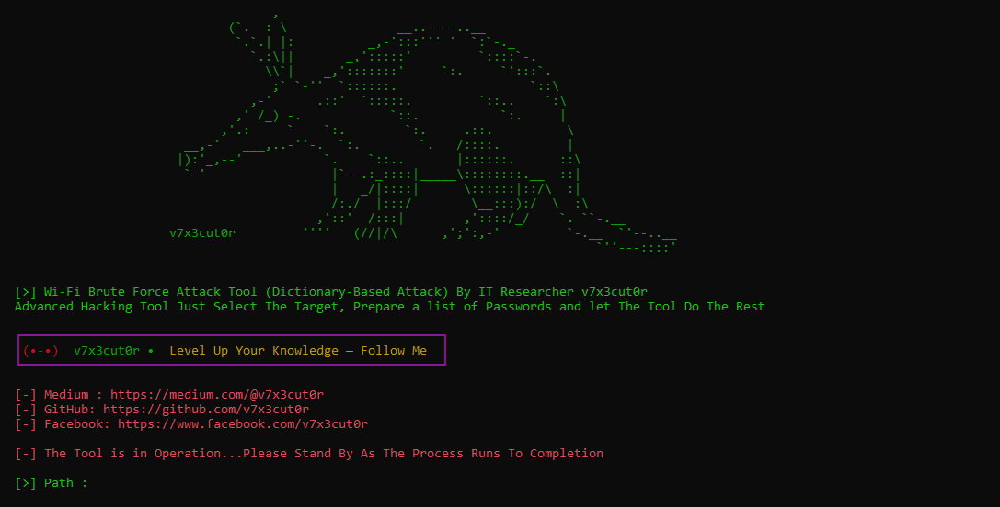

## 📡 WPFA - Tool Advanced Wi-Fi Brute Force

## 📌 Overview
WPFA is a Python-Based Tool Crafted by **v7x3cut0r** 
Built to Launch Brute Force Attacks On weak WiFi Networks and Exploit their vulnerabilities to Gain Access 👾

## ✨ Features
- 🖥 Easy Terminal interface
- 🔥 Save and resume Attack Progress
- 🚀 Support For Networks that Rely on the MAC Address in the Password
- 📶 Supports Most Wireless Network Interfaces
## 🛠️ Installation

    

 

## 📚 Documentation

  
To view the user guide for the tool, read a detailed article on Medium:

  

