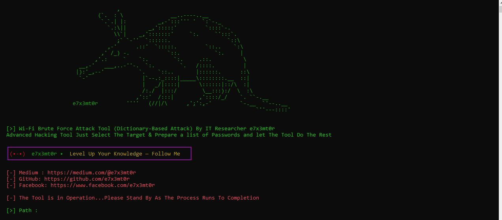

## 📡 NetR0x - An Advanced Wi-Fi Brute Force Tool

## 📌 Overview
NetR0x is a Tool Programmed And Developed By **e7x3mt0r**  
Designed to Launch Brute Force Attacks on Wi Fi Networks 👾

## ✨ Features
- 🖥 Easy Terminal interface
- 🔥 Save and resume Attack Progress
- 🚀 Support For Networks that Rely on the MAC Address in The Password
- 📶 Supports Most Wireless Network Interfaces
## 🛠️ Installation

    

 

## 📚 Documentation

  
To view the user guide for the tool, read a detailed article on Medium:

  

